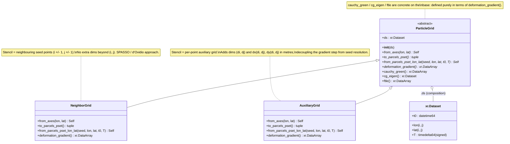
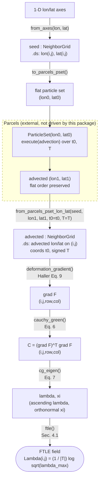

<!--
Visual overview of the particle-grid API scaffolded in
src/lcs_parcels/grids.py. Diagrams are kept in sync with the code; when the
class surface changes, update the class diagram, and when the workflow changes,
update the flow chart.
-->

# Architecture: particle grids

Visual overview of the diagnostic layer defined in
[`src/lcs_parcels/grids.py`](../src/lcs_parcels/grids.py). Naming and notation
follow Haller (2015), *Lagrangian Coherent Structures*, Annu. Rev. Fluid Mech.
47:137–162,
[doi:10.1146/annurev-fluid-010313-141322](https://doi.org/10.1146/annurev-fluid-010313-141322).
Timing conventions (`t0`, signed `T`) follow
[`plans/timing-design.md`](../plans/timing-design.md); symbols live in
[`docs/notation.md`](notation.md).

The package contains no Parcels code: a grid *emits* a particle set
(`to_parcels_pset`) and *ingests* the advected positions
(`from_parcels_pset_lon_lat`). Parcels itself sits outside this package and owns
the integration (including the sign of $T$).

## Class diagram

The two finite-difference strategies for the deformation gradient $\nabla F$ are
modeled as two explicit subclasses, not inferred at runtime from the dataset
dimensions. Each class *wraps* an `xr.Dataset` (held in `.ds`) by composition;
none subclasses `xr.Dataset`.

In the diagram, `*` marks an abstract method (each concrete subclass overrides
it); `from_axes` and `from_parcels_pset_lon_lat` are classmethods (constructors),
the rest are instance methods. The abstract methods are the per-strategy seam:
subclasses differ only in how they flatten/unflatten particles and how they
finite-difference $\nabla F$.
Everything downstream of the deformation gradient — the Cauchy–Green tensor
$C = (\nabla F)^\top \nabla F$, its eigen-decomposition $C\,\xi_i = \lambda_i\,\xi_i$,
and the FTLE $\Lambda = \tfrac{1}{|T|}\log\sqrt{\lambda_{\max}}$ — is shared
base-class behaviour.

## Flow chart: a typical session

Defining the particle grid, generating a particle set, advecting it with Parcels
(external), ingesting the result back into a grid, and estimating the FTLE. Nodes
on the package side are method calls; the dashed box is the external Parcels step
that this package does not drive.

The last four steps (`deformation_gradient` → `cauchy_green` → `cg_eigen` →
`ftle`) are the concrete base-class chain invoked under the hood by a single
`advected.ftle()` call; they are drawn explicitly to show where each Haller
quantity enters.

`AuxiliaryGrid` follows the identical workflow; the only differences are that the
particle set is additionally stacked over the auxiliary displacement dims
`(di, dj)`, and `deformation_gradient` differences across that per-point stencil
rather than against neighbouring seed points. Backward integration (attracting
LCS) is selected purely by passing a negative `T`; no separate direction flag
exists.
