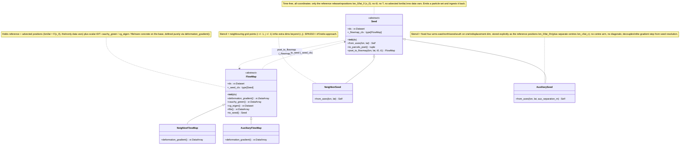
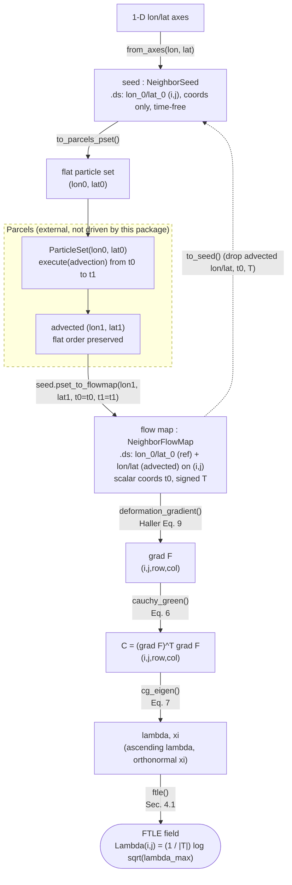

<!--
Visual overview of the seed / flow-map API implemented in
src/lcs_parcels/grids.py. Diagrams are kept in sync with the code; when the
class surface changes, update the class diagram, and when the workflow changes,
update the flow chart.
-->

# Architecture: seeds and flow maps

Visual overview of the diagnostic layer defined in
[`src/lcs_parcels/grids.py`](../src/lcs_parcels/grids.py). Naming and notation
follow Haller (2015), *Lagrangian Coherent Structures*, Annu. Rev. Fluid Mech.
47:137–162,
[doi:10.1146/annurev-fluid-010313-141322](https://doi.org/10.1146/annurev-fluid-010313-141322).
Timing conventions follow [`plans/timing-design.md`](../plans/timing-design.md):
a `Seed` is **time-free**; ingest (`pset_to_flowmap`) is given both the release
time `t0` and the end time `t1`, and the signed window `T = t1 - t0` is derived
and stored on the resulting `FlowMap`. Symbols live in
[`docs/notation.md`](notation.md).

The package contains no Parcels code: a `Seed` *emits* a particle set
(`to_parcels_pset`) and *ingests* the advected positions back into a `FlowMap`
(`pset_to_flowmap`). Parcels itself sits outside this package and owns the
integration; direction (the sign of $T$) follows from `t1` relative to `t0`.

## Class diagram

The lifecycle is split into two **sibling** families — a time-free `Seed` and a
`FlowMap` — that are *not* an inheritance pair: a `FlowMap` is not a kind of
`Seed` (it emits nothing to Parcels). Within each family the two
finite-difference strategies for the deformation gradient $\nabla F$ are modeled
as two explicit subclasses (`Neighbor*`, `Auxiliary*`), not inferred at runtime
from the dataset dimensions. Each class *wraps* an `xr.Dataset` (held in `.ds`)
by composition; none subclasses `xr.Dataset`. The two families are linked only
by the paired class attributes `_flowmap_cls` (seed to its flow map) and
`_seed_cls` (flow map to its seed), and by the two crossing methods.

In the diagram, `*` marks an abstract method (each concrete subclass overrides
it); `from_axes` is a classmethod (constructor), the rest are instance methods.
`from_axes` and `deformation_gradient` are the per-stencil seam: subclasses
differ only in the stencil they lay down and in how they finite-difference
$\nabla F$. Everything else — emit/ingest on `Seed`, and the diagnostic chain on
`FlowMap` (the Cauchy–Green tensor $C = (\nabla F)^\top \nabla F$, its
eigen-decomposition $C\,\xi_i = \lambda_i\,\xi_i$, and the FTLE
$\Lambda = \tfrac{1}{|T|}\log\sqrt{\lambda_{\max}}$) — is shared base-class
behaviour.

## Flow chart: a typical session

Defining a seed, generating a particle set, advecting it with Parcels
(external), ingesting the result into a flow map, and estimating the FTLE. Nodes
on the package side are method calls; the dashed box is the external Parcels step
that this package does not drive. `to_seed()` closes the loop, recovering a
time-free seed for re-release.

The last four steps (`deformation_gradient` -> `cauchy_green` -> `cg_eigen` ->
`ftle`) are the concrete base-class chain invoked under the hood by a single
`fm.ftle()` call; they are drawn explicitly to show where each Haller quantity
enters.

The `Auxiliary*` pair follows the identical workflow; the only differences are
that the particle set is additionally stacked over the four-arm `displacement`
dim, and `deformation_gradient` differences across that per-point stencil rather
than against neighbouring grid points. Backward integration (attracting LCS) is
selected purely by passing `t1` before `t0` at ingest (so `T = t1 - t0` is
negative); no separate direction flag exists, and a zero window (`t1 == t0`) is
rejected with `ValueError`.

## Extracting LCS: shrink lines

Downstream of the FTLE, the geometric layer
([`src/lcs_parcels/tensorlines.py`](../src/lcs_parcels/tensorlines.py)) turns the
strain field into LCS **curves**. It is deliberately *not* methods on `FlowMap`
(which stays a gridded-diagnostics object) but two free functions that consume a
`FlowMap`'s xarray outputs — keeping the one new external dependency (`scipy`, for
grid interpolation) at the boundary:

- `ftle_ridge_seeds(ftle)` — start points at the FTLE ridge tops (windowed local
  maxima above a quantile floor);
- `shrink_lines(flowmap, seed_lon, seed_lat)` — integrates the $\xi_1$ tensor
  lines ($\dot r = \xi_1(r)$, Haller Table 1) through those seeds, returning an
  `xr.Dataset` of polylines on `(line, point)`.

Repelling vs. attracting is just *which* flow map is passed: forward gives
repelling LCS, backward gives attracting LCS (the same forward/backward duality that selects
the FTLE's sign of `T`). This composes the whole example —
`shrink_lines(forward, *ftle_ridge_seeds(forward.ftle()))` for repelling,
the `backward` flow map for attracting.
