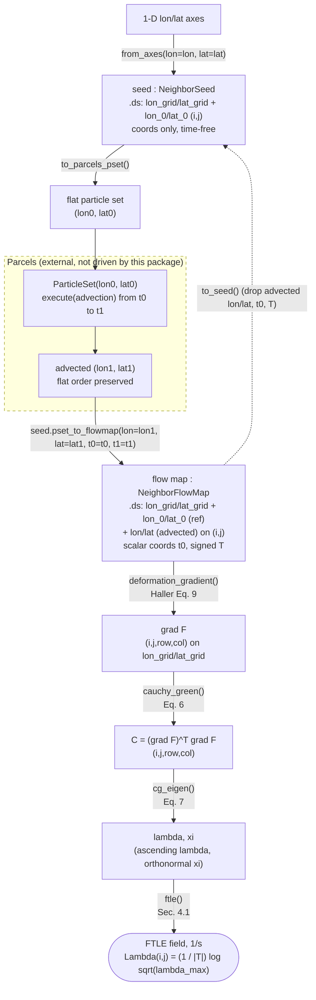

# Architecture: seeds and flow maps

Visual overview of the diagnostic layer defined in
[`src/lcs_parcels/grids.py`](../src/lcs_parcels/grids.py). Naming and notation
follow Haller (2015), *Lagrangian Coherent Structures*, Annu. Rev. Fluid Mech.
47:137–162,
[doi:10.1146/annurev-fluid-010313-141322](https://doi.org/10.1146/annurev-fluid-010313-141322).
Timing conventions follow [`plans/timing-design.md`](../plans/timing-design.md):
a `Seed` is **time-free**; ingest (`pset_to_flowmap`) is given both the release
time `t0` and the end time `t1`, and the signed window `T = t1 - t0` is derived
and stored on the resulting `FlowMap`. Symbols live in
[`docs/notation.md`](notation.md).

The package contains no Parcels code: a `Seed` *emits* a particle set
(`to_parcels_pset`) and *ingests* the advected positions back into a `FlowMap`
(`pset_to_flowmap`). Parcels itself sits outside this package and owns the
integration; direction (the sign of $T$) follows from `t1` relative to `t0`.

## Class diagram

The lifecycle is split into two **sibling** families — a time-free `Seed` and a
`FlowMap` — that are *not* an inheritance pair: a `FlowMap` is not a kind of
`Seed` (it emits nothing to Parcels). Within each family the two
finite-difference strategies for the deformation gradient $\nabla F$ are modeled
as two explicit subclasses (`Neighbor*`, `Auxiliary*`), not inferred at runtime
from the dataset dimensions. Each class *wraps* an `xr.Dataset` (held in `.ds`)
by composition; none subclasses `xr.Dataset`. The two families are linked only
by the paired class attributes `_flowmap_cls` (seed to its flow map) and
`_seed_cls` (flow map to its seed), and by the two crossing methods.


```mermaid
classDiagram
    class Seed {
        <<abstract>>
        +ds : xr.Dataset
        +_flowmap_cls : type[FlowMap]
        +__init__(ds)
        +lon_grid : xr.DataArray
        +lat_grid : xr.DataArray
        +__repr__() str
        +from_axes(kw lon, lat) Self*
        +to_parcels_pset() tuple
        +pset_to_flowmap(kw lon, lat, t0, t1) FlowMap
    }

    class FlowMap {
        <<abstract>>
        +ds : xr.Dataset
        +_seed_cls : type[Seed]
        +__init__(ds)
        +lon_grid : xr.DataArray
        +lat_grid : xr.DataArray
        +__repr__() str
        +grid_image() xr.Dataset*
        +deformation_gradient() xr.DataArray*
        +cauchy_green() xr.DataArray
        +cg_eigen() xr.Dataset
        +ftle() xr.DataArray
        +image(kw lon0, lat0) xr.Dataset
        +hyperbolic_lcs(kw window_m, quantile, min_anisotropy, step_m, line_length_m) xr.Dataset
        +to_seed() Seed
    }

    class NeighborSeed {
        +from_axes(kw lon, lat) Self
    }
    class AuxiliarySeed {
        +from_axes(kw lon, lat, aux_separation_m) Self
    }
    class NeighborFlowMap {
        +grid_image() xr.Dataset
        +deformation_gradient() xr.DataArray
    }
    class AuxiliaryFlowMap {
        +grid_image() xr.Dataset
        +deformation_gradient() xr.DataArray
    }

    Seed <|-- NeighborSeed
    Seed <|-- AuxiliarySeed
    FlowMap <|-- NeighborFlowMap
    FlowMap <|-- AuxiliaryFlowMap

    Seed ..> FlowMap : pset_to_flowmap (_flowmap_cls)
    FlowMap ..> Seed : to_seed (_seed_cls)

    note for Seed "Time-free, all-coordinates: diagnostic grid points\nlon_grid/lat_grid and reference release positions lon_0/lat_0 (x_0);\nno t0, no T, no advected lon/lat, no data vars.\nEmits a particle set and ingests it back."
    note for FlowMap "Holds reference + advected positions (lon/lat = F(x_0), the\nonly data vars) plus scalar t0/T. cauchy_green / cg_eigen / ftle / image /\nhyperbolic_lcs are concrete on the base, defined via deformation_gradient() and grid_image."
    note for NeighborSeed "Stencil = neighbouring grid points (i +/- 1, j +/- 1).\nNo extra dims beyond (i, j); lon_0/lat_0 equal lon_grid/lat_grid.\nSPASSO / d'Ovidio approach."
    note for AuxiliarySeed "Stencil = fixed four arms east/north/west/south on one\ndisplacement dim, stored explicitly as the reference positions lon_0/lat_0\naround the grid points lon_grid/lat_grid; no centre arm, no diagonals;\ndecouples the gradient step from seed resolution."
```

In the diagram, a trailing `*` marks an abstract member (each concrete subclass
overrides it) and `kw` marks the point past which arguments are keyword-only —
in Python, the bare `*` of `from_axes(*, lon, lat)`. `from_axes` is a
classmethod (constructor); `lon_grid`, `lat_grid` and `grid_image` are
properties, drawn with parentheses only because the diagram has no notation for
one; the rest are instance methods.

`from_axes`, `deformation_gradient` and `grid_image` are the per-stencil seam:
subclasses differ only in the stencil they lay down, in how they
finite-difference $\nabla F$, and in how the advected positions collapse onto
the diagnostic grid. Everything else — emit/ingest on `Seed`, and the diagnostic
chain on `FlowMap` (the Cauchy–Green tensor $C = (\nabla F)^\top \nabla F$, its
eigen-decomposition $C\,\xi_i = \lambda_i\,\xi_i$, and the FTLE
$\Lambda = \tfrac{1}{|T|}\log\sqrt{\lambda_{\max}}$) — is shared base-class
behaviour.

### Why `lon_grid`/`lat_grid` is one canonical pair

The obvious layout gives the diagnostic grid location no name of its own: it is
already `lon_0`/`lat_0` for the neighbour stencil, and for the auxiliary one,
where `lon_0` lives on `(i, j, displacement)`, it needs a second pair. One
concept under two names forces every downstream consumer to sniff the dataset
for which name is present — the exact runtime introspection the design rules
ban. Carrying `lon_grid`/`lat_grid` on both stencils removes the branch by
construction rather than hiding it behind a helper that branches internally.

`_grid` rather than `_c` for "centre": once the pair exists on both stencils,
"centre" is a misnomer for the neighbour case, which has no arms to be the
centre of. `_grid` says what the point is without knowing the auxiliary story,
which matters because this is the name on every plot axis and in every repr.

For the neighbour stencil `lon_grid` equals `lon_0`, and the value is stored
twice rather than aliased. That is the same call already made for the explicit
auxiliary arms: store the value, do not make a consumer reconstruct it from a
convention. The cost is one duplicated coordinate; the benefit is that a
dataset read off disk is self-describing.

The accessors are concrete one-liners on the two base classes, not abstract
properties overridden four times. Once the coordinate carries one name on both
stencils, `return self.ds["lon_grid"]` branches on nothing, so four identical
overrides would be dead duplication. `grid_image` *is* abstract and overridden,
because there the type genuinely carries information: the neighbour flow map
passes its advected positions through, the auxiliary one takes the centroid of
its four arms (with `skipna=False`, so one lost arm makes the grid point NaN,
matching what the deformation gradient does).

Diagnostics are labelled by `lon_grid`/`lat_grid` and *only* by that pair. The
release positions are dropped in `FlowMap._stencil_meters`, because on an
auxiliary flow map the surviving `lon_0` is one stencil arm — a point about `s`
metres from the grid point the diagnostic describes. Introducing a canonical
coordinate without removing the competing wrong one would have left the trap in
place.

`FlowMap.image` interpolates along axes relabelled `lon_grid`/`lat_grid`, so its
result would naturally come back carrying the caller's arbitrary reference points
under the grid-point name. It renames them to `lon_0`/`lat_0` before returning:
they are the $x_0$ that were mapped, not diagnostic grid points, and one name for
two quantities is the defect the canonical pair exists to remove.

### Why lon/lat pairs are keyword-only

Every public entry point that takes an adjacent lon/lat pair takes it
keyword-only: `from_axes`, `pset_to_flowmap`, `image`, and `shrink_lines`' seed
pair. Two same-typed adjacent arguments are the classic silent-swap footgun —
transposing them does not raise, it returns a plausible-looking field somewhere
off the coast of nowhere. The one thing a positional call buys, brevity, is
worth less than an error at the call site.

The rule is about same-typed neighbours, not about keywords for their own sake:
`shrink_lines(flowmap, ...)` keeps `flowmap` positional, since it is the only
argument of its type and there is nothing to transpose it with. The cost is that
the star-unpacking idiom is unavailable —
`pset_to_flowmap(*seed.to_parcels_pset(), ...)` does not work, and the 2-tuples
that `to_parcels_pset` and `ftle_ridge_seeds` return are unpacked into named
locals first. That is a fair trade for a call form whose entire risk was that it
hid which value went where.

### Why the tuning parameters are stated in their own units

The tunable quantities of the tensor-line layer are stated in the units of the
thing itself — `window_m`, `step_m` and `line_length_m` in metres,
`min_anisotropy` as a dimensionless eigenvalue ratio — and converted internally
against the field's own grid spacing, so the same call means the same thing at
any resolution and over any horizon. Expressed the natural implementation way
instead, the two lengths would depend on something other than what the caller is
asking for: a neighbourhood as a cell count depends on grid resolution, a line
as a step count depends on the step size.
`quantile` is left alone: making it absolute would change ridge selection from
relative-to-this-field to an absolute threshold, which is a science decision
rather than a units one.

Both lengths are budgets, not achieved quantities, and both invite the same
misreading. `line_length_m` bounds the traced arc: the
integrator spends at most `line_length_m / (2 * step_m)` steps per direction and
a line that terminates earlier is shorter, with the returned block NaN-filled
past termination so every row has equal length. `window_m` is the *side* of the
ridge-seed neighbourhood, which reaches only `window_m / 2` to either side of
its own grid point; two seeds can therefore sit about `window_m / 2` apart. That
is geometry, not measurement: the bound follows from the window's reach and
holds for any field. Anyone reading either budget as "the length you get" or
"the spacing you get" is off by a factor of two.

### Why the degeneracy guard is an eigenvalue ratio

`min_anisotropy` floors $\lambda_2 / \lambda_1$. It is the third form the guard
has taken, and the two rejected ones are recorded here because each was defended
on grounds the replacement also has to answer.

A raw $\lambda_2$ floor was rejected on the argument that it "silently retunes
as the window changes" — true: $\lambda_2$ grows exponentially in $|T|$, so a
fixed floor tightens as the window lengthens and a well-definedness guard drifts
into being a selector. A stretching-rate floor, `ftle_min_per_day`, cured that
by dividing out $|T|$ — but it retunes *worse*, across flow regimes rather than
across windows, which is the direction that actually bites. The 0.005/day
default was calibrated to the mesoscale ocean at a 7-day window.

The comparison below is a paper exercise across three flow regimes, and it rests
on one premise that has to be stated because everything follows from it: each
regime is integrated over a window $|T|$ *comparable to its own* $1/\mathrm{FTLE}$,
which is what one actually does — the window is chosen so the flow has time to
stretch by roughly one e-fold. That fixes the three $(\mathrm{FTLE}, |T|)$ pairs:

| Regime | FTLE | $\lvert T\rvert$ |
|---|---|---|
| fast laboratory flow | 6 /day | 6 h |
| mesoscale ocean (the calibration point) | 0.15 /day | 7 d |
| slow large-scale flow | 0.011 /day | 180 d |

Measured against each flow's own FTLE signal, the *fixed rate* 0.005/day is
$0.005/6 = 0.08\%$ for the laboratory flow and $0.005/0.011 = 45.5\%$ for the
slow one, where it would eat nearly half the field. The *ratio* form converts to
a rate through the window: a floor $a_{\min}$ on $\lambda_2/\lambda_1$ is, for
incompressible flow ($\lambda_1\lambda_2 = 1$), a $\lambda_2$ floor of
$\sqrt{a_{\min}}$ and hence an equivalent rate
$\tfrac{1}{|T|}\log\sqrt{\sqrt{a_{\min}}} = \tfrac{1}{4|T|}\log a_{\min}$. With
$a_{\min} = 1.15$ that is 0.0050/day at $|T| = 7$ d (the calibration identity),
0.140/day at 6 h and $1.9\times 10^{-4}$/day at 180 d — as fractions of the two
outer flows' FTLE, 2.3% and 1.8%. So the first argument was right about its
target and too narrow: a rate is scale-free in $T$ only.

The ratio retunes with neither, and it is also the physically correct quantity
rather than merely the scale-free one. The sensitivity of an eigenvector of $C$
to a perturbation of $C$ scales as the inverse of the *relative* gap between the
eigenvalues, so $\lambda_2 / \lambda_1$ is exactly what decides whether $\xi_1$
is a direction or numerical noise, and no stretching rate can stand in for it.
Measured: at the default 1.15 a 1% error in $C$ swings $\xi_1$ by about 2
degrees; at a ratio of 1.05 by 6 degrees; by a ratio of 4 it has flattened out
at about 0.25 degrees.

The default 1.15 is the old `ftle_min_per_day=0.005` behaviour carried over
essentially exactly: at the 7-day window of the examples that rate corresponded
to a $\lambda_2$ floor of 1.0725, which for incompressible flow
($\lambda_1 \lambda_2 = 1$) is a ratio of 1.15. The change of quantity is
therefore not a change of tuning at the calibration point — it is a change in
what happens away from it.

And away from it the difference is not academic, because the ocean surface is
not incompressible. Measured on the Cabo Verde example (5-day window, points
taken 34 km clear of any coast), the flow map's areal factor $\det \nabla F$ has
a median of 1.08 forward and 0.97 backward — nearly area-preserving in the bulk —
but ranges from 0.63 to 2.4 forward and from 0.045 to 14 backward. The implied
divergence reaches 0.08–0.13 /day at the 99th percentile, against a median FTLE
of about 0.13 /day: the same order as the signal.

Where $\det \nabla F$ departs from 1, a $\lambda_2$ floor and a
$\lambda_2/\lambda_1$ floor stop being interchangeable, and the divergence is
one-sided. On the backward flow the old $\lambda_2$ floor terminates 0.97% of
grid points against the ratio floor's 0.135%, and the 78 points it kills alone
have a median $\det \nabla F$ of 0.75 with a median ratio of 1.6 — strongly
convergent, and with $\xi_1$ perfectly well defined. A magnitude floor cannot
distinguish "nothing is stretching here" from "everything is contracting here",
so it preferentially terminates shrink lines inside convergence zones — which is
where attracting LCS live. On the forward flow of that same 5-day case, where
the median areal factor is above 1, the two guards agreed almost exactly — but
that agreement is a property of the window measured, not of forward flow in
general: at other windows the two termination rates part company, in both
directions. It is enough to explain why the bias never surfaced during
forward-only development.

### Why the metadata is attached at construction

`name`, `long_name` and `units` are stamped on the coordinates once, in
`from_axes` and `pset_to_flowmap`, and ride through the diagnostics untouched,
rather than being re-applied defensively in each operator. The consequence is
that a `FlowMap` built by hand from an unlabelled dataset stays unlabelled —
which is consistent with `FlowMap.__init__` already accepting, say, a
non-axis-aligned grid that `NeighborFlowMap` cannot correctly difference.

The metadata is not decoration: for the reader who verifies the science by
displaying datasets and plotting fields, the `long_name` *is* the plot title and
the `units` *is* the colorbar caption. It is also why no two quantities share a
`name` — `deformation_gradient()` and `cauchy_green()` are built by the same
helper but come back as `deformation_gradient` and `cauchy_green`, since two
distinct quantities under one name silently collide the moment they are merged
into a `Dataset`.

### Why the metres frame is equirectangular

Positions go into metres through an **equirectangular projection with a single
standard parallel** $\phi_{\mathrm{ref}}$ (the mean of `lon_0`/`lat_0`), and
both the reference and the advected positions are read in that one frame. It is
not a tangent plane, and describing it as one obscures where the error lives: a
tangent plane would be a local linearisation whose error grows with distance
from the touch point in *every* direction, whereas here $Y$ is exact by
construction and only the zonal scale is approximated, by being frozen at
$\cos\phi_{\mathrm{ref}}$.

Writing $c_0 = \cos(\text{release latitude})$, $c_1 = \cos(\text{arrival
latitude})$ and $c_{\mathrm{ref}} = \cos\phi_{\mathrm{ref}}$, the true gradient
relates to the one the package computes as

$$\nabla F_{\mathrm{true}}
= \mathrm{diag}\!\left(\tfrac{c_1}{c_{\mathrm{ref}}},\, 1\right)
  \nabla F_{\mathrm{ours}}
  \mathrm{diag}\!\left(\tfrac{c_{\mathrm{ref}}}{c_0},\, 1\right).$$

So $F_{yy}$ is exact; $F_{xx}$ is off by $c_1 / c_0$ — driven by *meridional
excursion* of the particle, with $c_{\mathrm{ref}}$ cancelling entirely — and
the two off-diagonals are off by $c_1 / c_{\mathrm{ref}}$ and
$c_{\mathrm{ref}} / c_0$. The dominant error term is therefore not the size of
the domain in longitude but how far particles travel in latitude relative to the
standard parallel.

That algebra is the whole error structure, and it needs no measurement to state.
What it says is that the error is set by *meridional excursion relative to the
standard parallel* — how far a particle's release and arrival latitudes sit from
$\phi_{\mathrm{ref}}$ — and not by domain width as such; a wide, thin zonal band
is fine, a narrow but meridionally tall one is not.

To put a scale on it, one analytic test flow map at one centre latitude gave a
median FTLE error of 0.65% over a 5-degree domain, 3.0% over 20 degrees and 15%
over 60 degrees. Those three numbers are an illustration of magnitude from a
single case, not a table of error-versus-domain-size: another flow, or the same
domain sizes at another centre latitude, moves them. The package is
consequently valid for regional domains of
modest latitude range with no dateline crossing, and is not currently correct
for basin-scale ones. Tracked in GitHub issue #18, alongside the related
dateline/longitude arithmetic in #13; the fix is exact and cheap — two diagonal
rescalings by cosines already carried in the dataset — so it need not wait for
the dateline work.

## Flow chart: a typical session

Defining a seed, generating a particle set, advecting it with Parcels
(external), ingesting the result into a flow map, and estimating the FTLE. Nodes
on the package side are method calls; the dashed box is the external Parcels step
that this package does not drive. `to_seed()` closes the loop, recovering a
time-free seed for re-release.


```mermaid
flowchart TD
    axes["1-D lon/lat axes"]
    seed["seed : NeighborSeed<br/>.ds: lon_grid/lat_grid + lon_0/lat_0 (i,j)<br/>coords only, time-free"]
    pset["flat particle set<br/>(lon0, lat0)"]

    subgraph parcels ["Parcels (external, not driven by this package)"]
        advect["ParticleSet(lon0, lat0)<br/>execute(advection) from t0 to t1"]
        out["advected (lon1, lat1)<br/>flat order preserved"]
    end

    fm["flow map : NeighborFlowMap<br/>.ds: lon_grid/lat_grid + lon_0/lat_0 (ref)<br/>+ lon/lat (advected) on (i,j)<br/>scalar coords t0, signed T"]
    gradF["grad F<br/>(i,j,row,col) on lon_grid/lat_grid"]
    C["C = (grad F)^T grad F<br/>(i,j,row,col)"]
    eig["lambda, xi<br/>(ascending lambda, orthonormal xi)"]
    ftle(["FTLE field, 1/s<br/>Lambda(i,j) = (1 / |T|) log sqrt(lambda_max)"])

    axes -->|"from_axes(lon=lon, lat=lat)"| seed
    seed -->|"to_parcels_pset()"| pset
    pset --> advect
    advect --> out
    out -->|"seed.pset_to_flowmap(lon=lon1, lat=lat1, t0=t0, t1=t1)"| fm
    fm -->|"deformation_gradient()<br/>Haller Eq. 9"| gradF
    gradF -->|"cauchy_green()<br/>Eq. 6"| C
    C -->|"cg_eigen()<br/>Eq. 7"| eig
    eig -->|"ftle()<br/>Sec. 4.1"| ftle
    fm -.->|"to_seed() (drop advected lon/lat, t0, T)"| seed

    style parcels stroke-dasharray: 5 5
```

The last four steps (`deformation_gradient` -> `cauchy_green` -> `cg_eigen` ->
`ftle`) are the concrete base-class chain invoked under the hood by a single
`fm.ftle()` call; they are drawn explicitly to show where each Haller quantity
enters.

The `Auxiliary*` pair follows the identical workflow; the only differences are
that the particle set is additionally stacked over the four-arm `displacement`
dim, and `deformation_gradient` differences across that per-point stencil rather
than against neighbouring grid points. Backward integration (attracting LCS) is
selected purely by passing `t1` before `t0` at ingest (so `T = t1 - t0` is
negative); no separate direction flag exists, and a zero window (`t1 == t0`) is
rejected with `ValueError`.

## Extracting LCS: shrink lines

Downstream of the FTLE, the geometric layer
([`src/lcs_parcels/tensorlines.py`](../src/lcs_parcels/tensorlines.py)) turns the
strain field into LCS **curves**. The extraction itself is deliberately *not*
implemented on `FlowMap` (which stays a gridded-diagnostics object) but as two
free functions that consume a `FlowMap`'s xarray outputs — keeping the one new
external dependency (`scipy`, for grid interpolation) at the boundary:

- `ftle_ridge_seeds(ftle)` — start points at the FTLE ridge tops (windowed local
  maxima above a quantile floor);
- `shrink_lines(flowmap, seed_lon=..., seed_lat=...)` — integrates the $\xi_1$
  tensor lines ($\dot r = \xi_1(r)$, Haller Table 1) through those seeds,
  returning an `xr.Dataset` of polylines on `(line, point)`.

Repelling vs. attracting is just *which* flow map is passed: forward gives
repelling LCS, backward gives attracting LCS — the forward–backward duality of
Haller & Sapsis 2011,
[doi:10.1063/1.3579597](https://doi.org/10.1063/1.3579597).
`FlowMap.hyperbolic_lcs()` runs the whole chain:

```python
lcs = forward.hyperbolic_lcs()   # repelling; backward.hyperbolic_lcs() for attracting
```

The method is named for the *family* of LCS it extracts, not for LCS in general:
elliptic LCS are a separate extraction with a separate parameter set, and giving
hyperbolic extraction the generic name `lcs()` would have to be undone the day
that lands (GitHub issue #8).

`hyperbolic_lcs()` is convenience, not a new abstraction. It exists because a
caller who just wants the curves should not have to know that the FTLE is
computed twice if they wire the three steps naively — it evaluates the field
once and hands it down. Ridge-finding deliberately keeps taking a *field* rather
than a `FlowMap`: passing the flow map would hide a recomputation, and a caller
who wants to smooth or mask the FTLE before picking ridges must be able to. The
convenience is therefore bought exactly once, in `hyperbolic_lcs()`, and the
three functions underneath stay independently callable.

`hyperbolic_lcs()` returns the curves *and* the FTLE field they were seeded from
in one `Dataset`. The first plot anyone makes is the curves over that field, and
the alternative is re-running an eigendecomposition of the whole grid to recover
something it had in hand; the `(line, point)` and `(i, j)` dims coexist
without conflict. Its parameters all default to `None` and only those the caller
set are forwarded, so `ftle_ridge_seeds` and `shrink_lines` remain the single
owners of their defaults. There is no direction argument — the flow map already
carries $\mathrm{sign}(T)$, and the returned dataset announces repelling
or attracting in its own `long_name` attributes.

`hyperbolic_lcs()` being a method while the extraction lives in `tensorlines`
means `grids` would import `tensorlines`, which already imports the metric
helpers from `grids`. The two names are therefore imported inside
`hyperbolic_lcs()` rather than at module level. The alternative — moving the metres frame into a third module —
would touch every import in the package to buy back two lines, so the deferred
import stands until something else needs that module to exist.

## Reprs

`Seed` and `FlowMap` carry terse one-line reprs, defined on the base classes and
reading the `lon_grid`/`lat_grid` accessors, so neither concrete class overrides
anything and a future stencil gets a correct repr for free:

```text
<NeighborSeed 6x5 grid, lon -25.00..-20.00, lat 15.00..20.00>
<NeighborFlowMap 6x5 grid, lon -25.00..-20.00, lat 15.00..20.00, t0 2020-01-01T00:00:00, T +7.0 days>
```

They are summaries, not dataset dumps: `.ds` remains how the dataset is
displayed, and a repr that is visibly *not* an xarray repr is itself a useful
signal that these objects wrap a dataset rather than subclass one.
